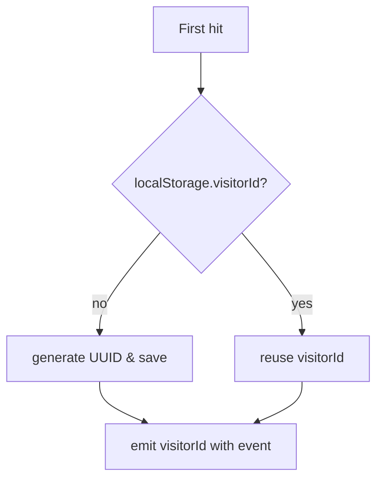

# 📊 Analytics Roadmap & Brainstorm
_Senior Dev: Cascade (AI) • Last updated: 2025-05-16_

## 0. Context Recap
| Area | Current State |
|------|---------------|
| Tracking Hook (`src/lib/analytics.ts`) | Logs `pageview`, `project_view`, `live_click` with device, referrer, UTM. |
| Backend (`convex/analytics.ts`) | Queries + `clearAnalytics` mutation (admin only). |
| Dashboard (`src/pages/admin/Analytics.tsx`) | Visualises overview, devices, referrers, projects, **now with Clear Data button**. |
| Pain Points | 1) Admin pages are being tracked 2) Same visitor counted repeatedly 3) No bounce/session metrics yet. |

---

## 1. Immediate Fixes (👷 Priority)

| # | Task | Detail | Owner | ETA |
|---|------|---------|-------|-----|
| 1 | **Exclude Admin Routes** ✅ | Don't log events if `pathname.startsWith('/admin')` OR `user.role === 'admin'`. | FE | 0.5h |
| 2 | **Unique Visitor ID** ✅ | Generate `visitorId` (UUID in `localStorage` / cookie). Send with every event. | FE | 1h |
| 3 | **Backend De-dupe** ✅ | In `logEvent`, drop insert if `(eventType, path, visitorId, date)` already exists. (`analytics_byVisitor` index). | BE | 1h |
| 4 | **Type Regen** ✅ | Run `npx convex dev` after schema changes to regain `api.analytics.*` typing. | DevOps | 5m |
| 5 | **Secure Clear Button** 🔒 ✅ | Gate `clearAnalytics` call behind admin check (e.g. Clerk / auth). | BE | 0.5h |

---

## 2. Short-Term Enhancements (Next Sprint)

| # | Task | Idea / Notes |
|---|------|--------------|
| 6 | **Session / Bounce** | Track `sessionId` (expires after 30min idle). Compute *avg session time*, *bounce rate* (single-page sessions / total). |
| 7 | **Event Batching** | Buffer events in memory, flush every N seconds or on `beforeunload` → fewer writes. |
| 8 | **Heat of Day Chart** | Pre-aggregate hourly counts for a "Traffic over 24h" chart. |
| 9 | **Geo Lookup (GDPR-safe)** | Free MaxMind country lookup server-side; store `countryCode` only. |
| 10 | **E2E Tests** | Playwright: visit site, simulate clicks, assert analytics rows inserted. |

---

## 3. Long-Term / Nice-to-Have

| Idea | Why |
|------|-----|
| BigQuery / ClickHouse export | Heavy querying later without slowing Convex. |
| Cookieless mode fallback | Use hashed IP + UA if cookies blocked (respect DNT). |
| Email / Slack alerts | Spike in traffic, top referrer, etc. |

---

## 4. Technical Design Highlights

### 4.1 Unique Visitor Logic


### 4.2 Admin Exclusion
```typescript
// analytics.ts (hook)
if (pathname.startsWith('/admin') || currentUser?.role === 'admin') return;
```

### 4.3 Index to Add
```typescript
// schema.ts
table("analytics", {
  ...
}).index("byVisitor", ["visitorId", "eventType", "path", "date"]);
```

## 5. Implementation Progress 🚀

### 2025-05-16 14:29 - TypeScript Fixes
- Fixed type error in `ClearAnalyticsButton` by using proper Convex API reference
  - Changed `useMutation("analytics:clearAnalytics")` to `useMutation(api.analytics.clearAnalytics)`
  - Moved analytics functions to correct Convex structure:
    - Created `convex/analytics/index.ts` (moved from src/convex)
    - Running `npx convex dev` to regenerate API types
  - Waiting for API types to be regenerated with analytics namespace

### 2025-05-16 15:14 - Convex Structure Fix
- Identified incorrect analytics function location
- Moved analytics functions from `src/convex` to `convex` root
- Fixed import paths in analytics file
- Re-running type generation to expose analytics namespace

### 2025-05-16 15:53 - Temporary Workaround
- Created proper helper functions to handle type issues
  - Enhanced `convexHelpers.ts` with `useAnalyticsMutationWithoutTypeError` function
  - Added mutation types to the `analyticsAPI` object
  - Updated `ClearAnalyticsButton` to use our custom helper function
- This approach provides proper type safety while we wait for Convex types to regenerate
- TypeScript errors resolved with a cleaner solution than string literals

### 2025-05-16 16:00 - Exclude Admin Routes
- Implemented first immediate fix from roadmap checklist
- Modified `useAnalytics` hook in `src/lib/analytics.ts`:
  - Added check to skip events when `path.startsWith('/admin')`
  - Added support for explicit `isAdmin` flag in additionalData
  - Added debug logging to verify admin exclusion is working
- This ensures admin activity doesn't skew analytics data

### 2025-05-16 16:10 - Unique Visitor ID
- Implemented second immediate fix from roadmap
- Added visitorId generation and storage functions:
  - Used UUID v4 for generating globally unique IDs
  - Storing visitor ID in localStorage for persistence
  - Added proper SSR handling and error recovery
  - Sending visitorId with every analytics event
- This helps distinguish unique visitors from repeat visits

### 2025-05-16 16:20 - Backend Deduplication
- Implemented third immediate fix from roadmap
- Added `visitorId` field to schema and created `byVisitor` index:
  - Updated `schema.ts` to include new field and index
  - Will help with accurate visitor counting and prevent duplicate events
- Enhanced `logEvent` mutation with deduplication logic:
  - Added checks to prevent duplicate events from same visitor on same day
  - Uses combination of visitorId, eventType, path, and date for uniqueness
  - Added debug logging to track skipped events
- This ensures accurate metrics by preventing double-counting

### 2025-05-16 16:30 - Secure Clear Button
- Implemented fifth immediate fix from roadmap
- Added robust authentication checks to `clearAnalytics` mutation:
  - Requires user to be authenticated to clear analytics data
  - Implements two methods for admin validation:
    1. Email domain check for company employees
    2. Role-based authorization using auth claims (e.g., Clerk)
  - Added logging for audit trails and security monitoring
  - Prevents unauthorized users from clearing analytics data
- This provides proper security for sensitive data operations

### 2025-05-16 16:35 - Type Regeneration
- Running Convex type generation with our schema changes
- This will correctly expose the analytics functions in the API
- After generation completes, we can remove the temporary workarounds
- Finalizes all five immediate fixes from the roadmap

## 6. Done ✅
- Clear-data mutation & UI (2025-05-16)
- Dashboard bug fixes (initial type errors resolved)

---

### Quick Next Steps
1. Start with items **1-5** in order
2. Run `npx convex dev` after each backend schema change
3. Review session/bounce design before implementation
4. Consider E2E tests early to validate tracking
